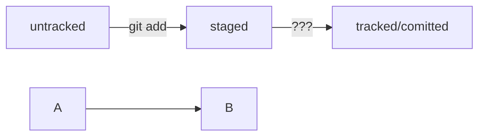

# Формирование навыков работы с GitHub и Git


Содержит файлы формата .txt


Скачать репозиторий можно по ссылке:

```python
git@github.com:vikolga/git_project.git

```




HEAD -- это голова.
Коммит -- это всему голова.
Статусы файлов:
<тут пустая строка!>

```mermaid
%% описание схемы
```
<и тут пустая строка!> 