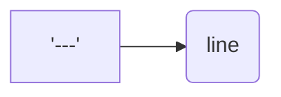

Разделительная линия
---
Чтобы сделать разделительную линию - добавьте сторку из дефисов

Текст над строкой становится выделенным без применения заголовков

Заголовки
---
Заголовки разного уровня созданы при помощи #  
*Перед строкой указывается столько символов #, какой уровень заголовке хотим получить*
# H1 - заголовок первого уровня
## H2 - заголовок второго уровня  
*Раздлелительная линия под заголовками первого и второго уровня появляется автоматически*
### H3 - заголовок третьего уровня
#### H4 - заголовок четвертого уровня
##### H5 - заголовок пятого уровня
###### H6 - заголовок самого маленького, шестого уровня

Разрыв строки
---
Для разрыва строки в конце нее нужно поставить два пробела - "  "
Иначе, даже если текст в файле перенесен, он продолжится на предыдущей строке, если между строками нет пустой строки.

Для того, чтобы начать новый абзац или параграф в конце также можно поставить 2 символа переноса, т.е., между строками присутствует одна пустая строка.

```bash
line another line
---
line

another line
```

line another line
---
line

another line

Выделение текста
---
```bash
*курсив*
_курсив_
**полужирный**
__полужирный__
**полужирный и _курсив_**
~~зачеркнутый текст~~
```

*курсив*  
_курсив_  
**полужирный**  
__полужирный__  
**полужирный и _курсив_**  
~~зачеркнутый текст~~  

Списки
---
Нумерованный список оформляется с помощью простой простановки цифр в начале каждой строки
```bash
1. First point
2. Second point
3. Third point
```
1. First point
2. Second point
3. Third point

Ненумерованный список создается при помощи проставления в начале каждой строки звездочки или дефиса
```bash
- First point
- Second point
- Third point
* First point
* Second point
* Third point
```
- First point
- Second point
- Third point
* First point
* Second point
* Third point
*Смешивать способы создания ненумерованного списка не получится*
```bash
* First point
- Second point
- Third point
```
* First point
- Second point
- Third point  
*Так как они воспринимаются как разные списки и отделяются отступом друг от друга*

Создание ссылок
---
Для создания ссылки для перехода на другой ресурс указываем в квадратных скобках, какой именно будет текст ссылки, далее в круглых ресурс, куда будем переходить
```bash
[Яндекс](https://www.yandex.ru)
```
[Яндекс](https://www.yandex.ru)

Для вставки картинки на сайте указываем в круглых скобках ссылку на местоположение картинки  сети интернет, а в начале строки ставим обязательно "!"
```bash

```


Вставка кусков кода
---
Для оформления кода, его окружают ``` с обеих сторон и указывают в первой строке азык кода. например
```bash
```bash
ls -la```
```html
<h1> А я простой текст</h1>```
```
Результатом выполнения будет
```bash
ls -la
```
```html
<h1> А я простой текст</h1>
```
